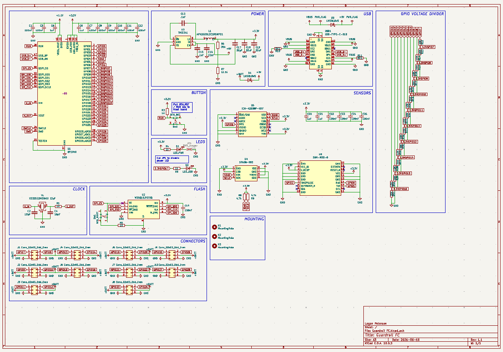

# Guardrail FC - A Flight Assist that helps you not crash!

### With a side of data logging and autopilot.

---

## Renders
*visuals because everyone loves eye candy.*

  
  
  
  
  

---

## BOM
All the sensing and thinky bits live **[here](/BOM.csv)**.

**Main characters:**
 - **Microcontroller:** RP2040
 - **Storage:** W25Q16JVUXIQ 16Mbit SPI flash
 - **Sensors:**
   - ICM-42688P-HXY 6-axis IMU
   - SAM-M8Q-0 GNSS module
   - SPA06-003 pressure sensor
 - **Misc:** Boot circuitry, pull-ups, decoupling, and other necessary magic

(See `BOM.csv` for full part values, footprints, and sourcing.)

---

## What is this?

The **Guardrail FC** is a **Flight Controller** built around a RP2040 microcontroller and a handful of sensors, designed to help you not crash your RC planes and drones!

It does this by sitting in the middle of the data signals between the RC reciever and the plane's control surfaces / throttle. The board will use the pilot's input to steer the plane, but will lock the plane to certain bank angles in order to prevent the plane from flipping upside down and crashing. The board also logs all the sensor data and pilot inputs to its onboard flash, which can be retrieved after the flight to analyze flight characteristics afterwards.

---

## How It Works

On startup, the board will continuously read the IMU, GNSS, and pressure sensors to get an idea of the plane's orientation, position, and altitude. From these readings, the board calculates what angles the servos need to be at to get to a certain desired angle using a PID loop.

The board will then read the pilot's input from the RC receiver, and use that to control the desired angle for the plane.

At a high level:
1. Read sensors to get current orientation, position, and altitude.
2. Read pilot input to get desired angle.
3. Use PID loop to calculate servo angles needed to achieve desired angle.
4. Output servo angles to control surfaces and throttle.

---

## Features

### Flight Assist
The main feature of the Guardrail FC is its flight assist capabilities. By using the IMU data, the board can determine the plane's current orientation and adjust the control surfaces to keep the plane within a certain bank angle, preventing it from flipping upside down and crashing.

### Data Logging
The board logs all sensor data and pilot inputs to its onboard flash memory. This allows you to analyze flight characteristics after the flight.

### Autopilot
In addition to flight assist, the firmware includes a guarded automatic-throttle mode that uses pressure altitude, vertical speed, aircraft attitude, and optional GNSS ground speed. Waypoint navigation remains future work.

---

## Firmware

The firmware lives in **[`Firmware/`](/Firmware/)** and is written in Python using MicroPython. Interrupt-driven input capture keeps all ten receiver channels live while the controller reads sensors and logs the flight.

See the [`Firmware/README.md`](/Firmware/README.md) for more details on how to set up the firmware and tune the board for your specific plane.

---

### Why?

Because crashing is bad, and this board helps you not crash! I've had an interest in RC planes and drones for a while, and by making this board, I can run whatever kind of firmware I want to create interesting flight characteristics. One of my friends recently created and crasshed their custom built plane, and I wanted to make something that might have been able to save it!

---

## Contributing

This is a personal project, but if you have any ideas or suggestions, feel free to open an issue or submit a pull request! I'm always open to feedback and improvements.

## Disclaimer

This project is still in development, and I have yet to test it in flight. Remember to test in a safe environment before flying with hardware from a random internet person! I am not responsible for any crashes or damage caused by this board. Use at your own risk!

  

